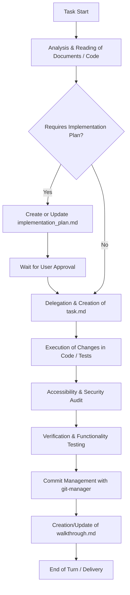

# ⚡ Agent Guide & Workflow — Edison Dev Portfolio & CyberStack AI

This file defines the behavior rules, subagent responsibilities, skills matrix, and technical standards of the **Edison Dev Portfolio & CyberStack AI** project. It must be consulted by any agent before starting development, refactoring, or auditing tasks.

---

## 🛠️ 1. Project Technical Context

The project is the personal professional portfolio for **Edison Isaza** (Senior Full Stack, Cybersecurity, and Financial Algorithms Engineer) and features **CyberStack**, an advanced AI assistant representing Edison's professional persona.

- **Frontend / Core**: Next.js 16 (App Router) + React 19 + TypeScript 5
- **Styling**: Tailwind CSS v4.0.0 (PostCSS) and custom CSS modules.
- **Database & Persistence**: Redis (used for chat history, dynamic page views counter, and GitHub repositories API cache)
- **AI Core**: Google Gemini Flash Lite (using Google Generative AI SDK `@google/generative-ai`)
- **Metadata and Schema**: Robots.txt, dynamic Sitemap, JSON-LD, Open Graph

---

## 🔄 2. Workflow and Task Coordination

Any main agent assigned to a task must follow this iterative workflow:

### Planning Protocol (Planning Mode)
1. **When to Plan**: Structural visual layout changes, major API changes in the chatbot or Redis logic, or configuration updates affecting critical assets.
2. **When to Proceed Directly**: Adding or updating projects in profile configurations, styling fixes, creating missing test files, or writing documentation.

---

## 👥 3. Subagents: Roles and Delegation

The workspace has 5 specialized subagents. Proper usage prevents context duplication and accelerates development.

### 🎨 `ui-ux-designer`
- **When to delegate**: Designing new portfolio sections, creating responsive components, aesthetic refactoring using Tailwind CSS 4, animations with Framer Motion, and custom CSS module styling.
- **Key instructions**: Maintain the sleek, dark minimalist design system defined in `globals.css`. Ensure proper use of `react-icons`. Mock interactive elements with dynamic hover, focus, and transition feedback.

### ♿ `a11y-auditor`
- **When to delegate**: Before finalizing any UI or upon receiving specific web accessibility feedback.
- **Key instructions**: Audit interactive elements (buttons, inputs, links), ensure keyboard navigation (tabindex, clear focus outlines), and compliance with WCAG 2.2 Level AA.

### 🧪 `test-engineer`
- **When to delegate**: Creating unit/integration tests and verifying edge cases for API endpoints or component rendering.
- **Key instructions**: Write tests using Vitest and React Testing Library. Clear mocks after each test. If Vitest isn't fully installed or initialized in the environment, guide the user to perform the initial setup package installation.

### 🛡️ `security-auditor` (ReadOnly)
- **When to delegate**: Reviewing dependencies for vulnerabilities, checking exposed API routes, or auditing potential client key exposures.
- **Key instructions**: Run diagnostic commands (`pnpm audit`, `pnpm outdated`) strictly in Read-Only mode. Deliver structured reports detailing impact and action plans without mutating the codebase.

### 📦 `git-manager`
- **When to delegate**: Upon successful verification of any change to prepare commits and structure Git history.
- **Key instructions**: Run `git status` and `git diff` to analyze exact changes, stage target files cleanly (avoiding indiscriminate `git add .`), and write commit messages following the Conventional Commits convention.

---

## 📚 4. Skills Matrix

For each work area, the main agent or subagent **must first read** the corresponding Skill documentation using `view_file` on its `SKILL.md` file:

| Work Area | Required Skill | Skill Path |
|---|---|---|
| **Performance / RSC / App Router** | `next-best-practices` | `.agents/skills/next-best-practices/SKILL.md` |
| **Rendering optimization & testing** | `react-best-practices` | `.agents/skills/react-best-practices/SKILL.md` |
| **Component Architecture** | `composition-patterns` | `.agents/skills/composition-patterns/SKILL.md` |
| **Cache strategies & PPR** | `next-cache-components` | `.agents/skills/next-cache-components/SKILL.md` |
| **Advanced TypeScript / API typing** | `typescript-advanced-types` | `.agents/skills/typescript-advanced-types/SKILL.md` |
| **Styles / Visual Components** | `tailwind-css-patterns` | `.agents/skills/tailwind-css-patterns/SKILL.md` |
| **Premium Design & Aesthetics** | `frontend-design` | `.agents/skills/frontend-design/SKILL.md` |
| **Accessibility (a11y)** | `accessibility` | `.agents/skills/accessibility/SKILL.md` |
| **SEO Optimization** | `seo` | `.agents/skills/seo/SKILL.md` |

---

## 🔒 5. Technical Standards and Coding Conventions

The agent must ensure consistency with the following project architectural guidelines:

### A. Neural Activation and CyberStack Context
1. **Expert Persona Prompt**: Defined in `src/app/utils/expert_persona.xml`. It enforces a strict professional consultant persona representing Edison Isaza.
2. **Context Compilation API**: The endpoint `/api/agent-context` reads LinkedIn-like profile data from `src/data/profile.json` and real-time project listings from GitHub (retrieved via `src/app/utils/github.ts`), injecting them into placeholders `{{PROFILE_CONTEXT}}` and `{{GITHUB_CONTEXT}}` dynamically.
3. **Prime Directive**: The AI must always respond in the third person ("Edison is...", "He has...").

### B. Persistent Chat logs and Caching in Redis
1. **Persistent Memory**: Chat logs are sent to Redis via `/api/log-chat`.
2. **GitHub API Caching**: To avoid rate limiting, repository metadata is cached in Redis with a 1-hour (3600 seconds) TTL. Refer to `src/app/utils/github.ts` and `src/app/utils/redis.ts`.
3. **Analytics**: Increment views for project detail pages using Redis counter keys `views:{slug}`.

### C. Styling & UI/UX Principles
1. **Forced Dark Mode**: Theme variables in `src/app/globals.css` define `#0a0a0a` as the background and `#ededed` as the foreground by default.
2. **Typography**: Uses Geist Sans (`font-sans`) and Geist Mono (`font-mono`) inside Tailwind configuration.
3. **Iconography**: Rely on `react-icons` for clean and optimized icons import.
4. **Smooth Transitions**: Implement subtle framer-motion animations for page loading, chat expand, and hover interactions.

### D. Package Manager Commands
- **Only pnpm**: Use only and exclusively `pnpm` for installing dependencies and running scripts (e.g., `pnpm dev`, `pnpm build`, `pnpm lint`).

---

## 📈 6. QA Checklist for Deliveries

Before notifying the user about a completed task, validate:
- [ ] **Lints and Compilation**: Run `pnpm run lint` and verify that no TypeScript typing errors or styling lint errors remain.
- [ ] **Redis Connection**: Check that local fallback is configured in case of missing `REDIS_URL`.
- [ ] **Mobile Responsiveness**: Test components on small, medium, and large layouts.
- [ ] **Accessibility Audit**: Check focus rings on links and interactive elements, ensuring ARIA descriptors exist for icons.
- [ ] **Git Workflow**: Stage atomic commits via `git-manager` with clean Conventional Commits messages.
